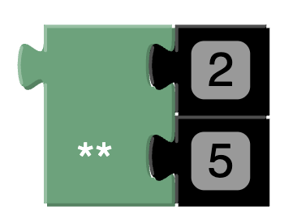

# Exponent

Defines the exponent of an integer.

For example, `2^5` is defined in Conjure Blocks as follows:



Where the top value is the base, and the bottom is the exponent. 

This would produce the following Conjure Output:

```essence
2 ** 5 
```