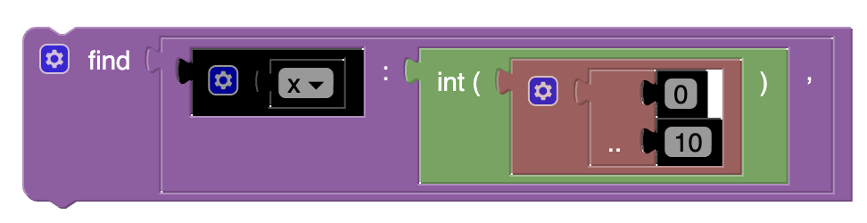

[//]: # (author: Jamie Melton)
# Find Statement

This block is used to declare decision variables. It must be nested in a `find` block. This block can also be extended 
so that it can store a list of decision variables.

For example, it can be used like this:



Which would produce the following Essence Output:

```essence
find  x : int (  0 .. 10  ) 
```