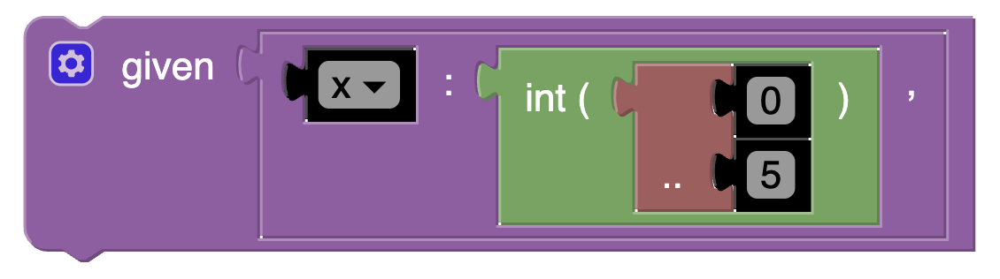

[//]: # (author: Jamie Melton)
# Given List 

Used to declare a parameter and its domain.

For example, it can be used like this:



Which would produce the following Essence Output:

```essence
given x : int ( 0 .. 5  )  ,
```