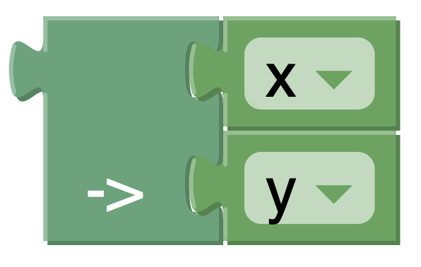

# Implication

A logical expression. where the following truth table holds.

Let x and y be some boolean variables.

| x     | y     | x /\ y |
|-------|-------|--------|
| true  | false | false  |
| false | true  | true   |
| true  | true  | true   |
| false | false | true   |

For example, it can be used like this:

The statement `x implies y` would be represented in Conjure Blocks as follows:



and would produce the following Conjure Output:

```essence
x /\ y
```