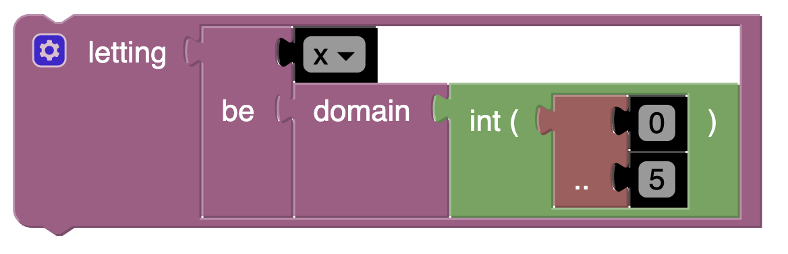

[//]: # (author: Jamie Melton)
# Letting Statement

Assigns a variable to some domain. Can be extended to a list.

For example, it can be used like this:



Which would produce the following Essence Output:

```essence
letting x be domain int ( 0 .. 5  )
```